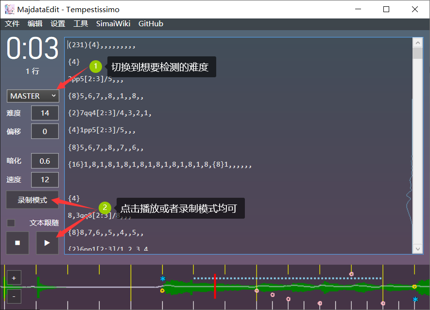

<!--
 * @Author: moying
 * @Date: 2021-08-17 14:58:21
 * @LastEditTime: 2021-08-17 16:39:13
 * @LastEditors: Please set LastEditors
 * @Description: 自述文件
 * @FilePath: \maimaiMuriDetector\README.md
-->
# maimaiMuriDetector

## 简介

一个maimai谱面无理配置检测器

a maimai beatmap muri notes detector

- [maimaiMuriDetector](#maimaimuridetector)
  - [简介](#简介)
  - [检测内容](#检测内容)
    - [多押](#多押)
    - [撞尾](#撞尾)
  - [使用](#使用)
    - [直接使用](#直接使用)
      - [交互模式](#交互模式)
      - [命令行模式](#命令行模式)
    - [作为模块调用](#作为模块调用)
  - [TODO](#todo)

## 检测内容

目前maimaiMuriDetector只保证可以检测**非dx谱面**。

目前maimaiMuriDetector可以检测：

- 多押
- 撞尾

未来计划实现的一些无理检测功能可见[TODO](#TODO)

### 多押

若某一时间点，谱面中出现超过双押以上的行为，就会被视为多押，并给出警告。

如某一slide正在进行，此时出现一对each tap，则此时会被判定为多押。

maimaiMuriDetector检测多押时，会**始终尝试正攻slide**。换言之，在一个较慢的slide**正在滑动**时，出现一对**双押**是**不被允许的**，**即便玩家实际操作时不会用手始终跟随slide滑动。**

如果您的谱面是协力宴谱，或允许出现多押的宴谱，您也可以在使用时禁用多押检测。

### 撞尾

所有的slide在结束时会进入A区，一些slide在中途也会经过A区（如pp/qq型、V型等）。

如果这些slide经过A区时，此A区有note进入了**判定区间**，则这个note会被意外的**通过内屏触发**。这样的情况被称为**撞尾无理**。

maimaiMuriDetector检测撞尾时，会**始终正攻slide**。换言之，maimaiMuriDetector会模拟玩家**始终用手紧紧跟随slide**的情况。即便一些撞尾问题可以通过提前滑或延后滑的方式解决，但是这些问题仍然会被视为无理配置。

关于撞尾检测的精度问题，可见[下文](#交互模式)。

## 使用

需要python 3.6以上运行环境。未来会集成在[MajdataEdit](https://github.com/LingFeng-bbben/MajdataEdit)中。

`maiMuriDetector.py`是核心文件，您可以直接使用，也可以作为模块调用。

### 直接使用

通过python运行`maiMuriDetector.py`，不带任何选项参数，或传入`-h`/`--help`选项，脚本会显示帮助信息

```shell
 $ python maiMuriDetector.py --help
帮助信息
maimaiMuriDetector [-h] [-i] [-c] [-m [-s]] [filepath]
-h --help               显示本帮助信息
-i --interactive        适合电......
```

#### 交互模式

传入`-i`/`--interactive`选项，maimaiMuriDetector会以**交互模式**运行。

```shell
 $ python maiMuriDetector.py -i
请输入majdata.json的路径(也可将文件拖拽至该窗口):_
```

maimaiMuriDetector需要您输入谱面文件中`majdata.json`的路径。

`majdata.json`由[MajdataEdit](https://github.com/LingFeng-bbben/MajdataEdit)生成。您需要使用`MajdataEdit`打开您的simai谱面文件(`maidata.txt`)，切换至想要检查的谱面难度(如MASTER)，并单击**播放**或“**录制模式**”。



此时，`MajdataEdit`就会在您谱面文件的同一个文件夹中生成对应难度的`majdata.json`文件。

> 注意：majdata.json中只包含一个难度的谱面信息。如果您之后又切换到其他难度并进行了播放，那么原先的majdata.json就会被覆盖。另外，当您修改谱面后，您需要至少播放一次，majdata.json中的信息才会变动。

您可以复制这个文件的完整路径，或者在需要输入文件路径时，**直接将文件拖拽至命令行窗口**，**绝大部分**命令行窗口都会自动识别并输入文件的路径。

> `Majdata`由`MajdataEdit`和`MajdataView`组成，是由国人开发者完成的新一代maimai制谱器、看谱器，也是simai的有力替代产品。现在由bbben和多名爱好者共同开发完善。
> `MajdataEdit`相比于过去的记事本或notepad++制谱，不仅可以提供音频可视化、小节线提醒、note可视化以外，还有迅速定位note在文本中的位置，快速翻转某一段note等实用的功能。
> `MajdataView`是新一代maimai看谱器，是目前最接近本家视觉效果的看谱器。软件使用unity开发，无需配置复杂的环境，开箱即用。可与MajdataEdit端联动，实现暂停、回放功能，易于调试和使用。

之后，maimaiMuriDetector会询问您关于**多押检测**和**撞尾检测精度**的设置。

**多押检测**会检测谱面中可能出现的多押(常见于slide时)，**默认开启**此检测。但是如果您想为您的**协宴**，或**允许出现多押的宴谱**(如[宴]Oshama Scramble)进行无理检测，那么您可以禁用这项功能。

**撞尾检测精度**设置会影响到maimaiMuriDetector对于撞尾无理配置的检测严格程度。这项设置的单位是**毫秒**，**默认值为150**。

当精度设置为150ms时，相当于最宽松的撞尾检测，**若设置低于150ms，则可能会出现绝对无法正攻的无理配置，所以请不要设置低于150的值**。

相反的，如果您想更严格的审查谱面，检查是否存在难以正攻或容易蹭tap的配置，您可以适当提高精度，如200ms。

上述两项设置如果什么都不输入直接按下回车的话，就会使用默认值来代替。

**随后maimaiMuriDetector会完成审查，并给出结果和建议。**

#### 命令行模式

传入`-c`/`--command-line`选项，maimaiMuriDetector会以**命令行模式**启动。

在**命令行模式**中，您需要直接将各个设置和参数**一次性传入maimaiMuriDetector**

最简单的使用中，您只需要传入majdata.json的路径。需要注意的是，如果您的**路径中存在空格**，您需要用半角引号包围您的路径

```shell
 $ python maiMuriDetector.py --command-line "D:\simai\Tempestissimo Remake\majdata.json"
【谱面信息】
Tempestissimo - t+pazolite
MASTER lv.14
......
```

如同在交互模式中一样，您也可以修改**多押检测**和**撞尾检测精度**两项设置。

传入`-m`/`--mult-note-detection`来控制是否禁用**多押检测**：

```shell
 $ python maiMuriDetector.py -c -m false ./majdata.json
 $ python maiMuriDetector.py -c -m f ./majdata.json
 $ python maiMuriDetector.py -c -m 0 ./majdata.json
// 以上均可禁用多押检测
 $ python maiMuriDetector.py -c --mult-note-detection=false ./majdata.json
// 亦可使用长选项格式
```

传入`-s`/`--slide-detection-accuracy`来调整**撞尾检测精度**：

```shell
 $ python maiMuriDetector.py -c -s 200 ./majdata.json
 $ python maiMuriDetector.py -c --slide-detection-accuracy=false ./majdata.json
// 长短选项格式均可
```

另外，您也可以省略`-c`选项，**maimaiMuriDetector默认工作在命令行模式下**。

### 作为模块调用

您也可以将`maiMuriDetector.py`作为python模块来使用。

**目前maiMuriDetector作为模块来使用的功能并不完善，后续开发会进一步优化。**

从`maiMuriDetector.py`中引入`MaiMuriDetector`类来开始使用：

```python
from maiMuriDetector import MaiMuriDetector
```

检测器类初始化时需要传入majdata.json的路径：

```python
from maiMuriDetector import MaiMuriDetector

mmd = MaiMuriDetector(filepath)
```

调用对象的`detectMuri`方法，可以开始进行检测。方法需要2个参数，即多押检测和撞尾精度(单位秒)。

```python
from maiMuriDetector import MaiMuriDetector

mmd = MaiMuriDetector(filepath)
mmd.detectMuri(
    multNoteDetectEnable = True,
    slideDetectAccuracy = 0.15
)
```

您也可以分别调用对象的`multNoteDetect`和`slideDetect`方法，这两个方法分别对应多押检测和撞尾检测，检测中发现的错误会直接打印在控制台中，方法则会返回检测到的错误数量。

检测时发现错误的输出信息**暂时无法更改**，后续开发会进一步优化。

## TODO

- 蹭slide无理（内屏完成tap导致提前完成了slide，或其他slide完成时会导致某slide被提前完成）
- 更好的交互
- 集成至MajdataEdit
